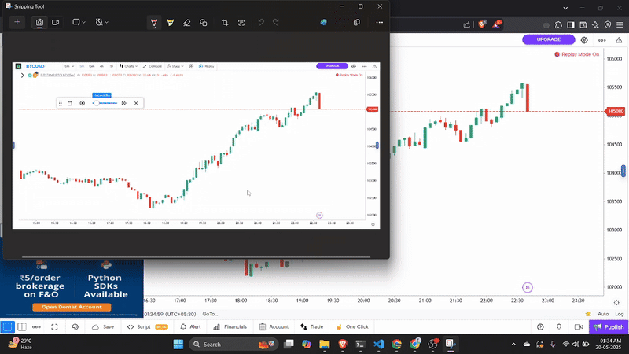

# 📸 Gemini SMC Trading App

This is a **Streamlit-based AI trading assistant** that analyzes uploaded chart images using **Google's Gemini Vision model** and provides sniper trade setups based on **ICT Smart Money Concepts (SMC)**. The model returns **Buy/Sell signals**, **entry**, **stop loss**, and a detailed **rationale**.

---
## Demo Video 


## 🔥 Features

- 📤 Upload 5-minute trading chart images (e.g., NIFTY, Bank Nifty)
- 🧠 AI analyzes BOS, CHoCH, FVG, OB, and liquidity zones
- 🎯 Get sniper trade entries with:
  - Buy/Sell signal
  - Entry and Stoploss
  - Reason for taking or avoiding the trade
- 🤖 Built on `gemini-1.5-flash` from Google Generative AI
- 🌐 Streamlit frontend for instant feedback

---

## 🚀 Getting Started

### 1. Clone the Repository

```bash
git clone https://github.com/your-username/gemini-smc-sniper.git
cd gemini-smc-sniper
```

### 2. Set Up Python Environment
python -m venv venv
source venv/bin/activate  # or venv\Scripts\activate on Windows
pip install -r requirements.txt

### 3. Add Your Environment Variables
GEMINI_API_KEY=your_gemini_api_key
#### https://makersuite.google.com/app/apikey --> get the api key here

### Run the App
streamlit run vision-app.py
